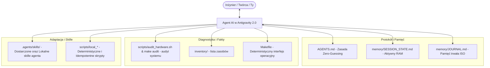

# `pl-agentic-sysadmin` — Autonomiczny 'Workstation Hub' & Protokół Agentic AI SysAdmin (PL)

[](LICENSE)
[](https://www.youtube.com/@mnemoshift)

> 🌐 **English Documentation:** Looking for the English guide and quickstart? [Read README_EN.md](README_EN.md).

> *Autonomiczne centrum kontroli, audytu i odtwarzania stacji roboczej Linux, współpracujące w modelu ciągłej pamięci z agentami AI (Antigravity IDE, Claude Code) — edycja polskojęzyczna.*

Tradycyjne podejście do konfiguracji systemu (ręczne wklepywanie komend, niespójne dotfiles, amnezja chatbotów w przeglądarce) zawodzi w erze inżynierii agentowej. **`pl-agentic-sysadmin`** zamienia Twoje repozytorium w żyjący hub stacji roboczej, który daje agentowi AI oczy (audyt sprzętu), ręce (deterministyczne skrypty i Makefile) oraz trwałą pamięć.

---

## 🚀 Szybki Start: Uruchomienie w Antigravity 2.0

### Krok 1: Pobranie repozytorium (Terminal)
Wklej w terminalu polecenie klonowania:
```bash
git clone https://github.com/mnemoshift/pl-agentic-sysadmin.git ~/workspaces/pl-agentic-sysadmin
```

### Krok 2: Otwarcie i konfiguracja projektu w Antigravity 2.0
1. Uruchom **Antigravity 2.0** (z menu aplikacji Zorina lub poleceniem `antigravity`).
2. W lewym panelu bocznym przejdź do sekcji **Projects** $\rightarrow$ kliknij **Add Project** (lub **Open Folder**) i wskaż sklonowany katalog:  
   `~/workspaces/pl-agentic-sysadmin`
3. **Konfiguracja bezpieczeństwa (Potwierdzanie komend):**
   * W prawym górnym rogu okna czatu / ustawieniach projektu:
   * Ustaw **Agent Settings -> Security Preset** na `Default`.
	   * Przy tym ustawieniu Agent poprosi Cię o autoryzację komend shellowych.
   * Ustaw **Agent Behavior -> Artifact Review Policy** na `Always Ask`
	   * Dzięki temu Agent przed każdą modyfikacją systemu zaprezentuje plan operacyjny (*Implementation Plan*) do akceptacji.
   * Jeżeli nabierzesz zaufania, zmęczysz się ciągłą akceptacją, lub po prostu chcesz zostawić agenta by działał a ty zajmował się innymi sprawami, można rozluźnić te restrykcje by Agent otrzymał większą autonomię w działaniu.
1. Gotowe — Agent natychmiast załaduje reguły `AGENTS.md` oraz Core Skill `desktop-manager`.

---

## ⚡ Dostępne Polecenia Operacyjne (Makefile)

Jeśli wolisz wywoływać procedury bezpośrednio z konsoli:
```bash
# Wyświetlenie wszystkich dostępnych komend
make help

# 🖥️ Zarządzanie profilem pulpitu (Dwutorowy Silnik: Wayland + X11)
make desktop-macos   # Wdrożenie profilu emisyjnego macOS (WhiteSur, kropki po lewej, autodetekcja Wayland/X11, CSD fix)
make desktop-studio  # Wdrożenie profilu Cyber Studio (MnemoShift Cyber-Blueprint, Top Bar Emission HUD, Conky HUD)
make desktop-reset   # Natychmiastowy powrót do stanu fabrycznego Zorin OS (1 sekunda)
make desktop-status  # Audyt serwera wyświetlania (Wayland/X11), dekoracji okien, pozycji paska i doku

# 🔍 Audyt sprzętu i oprogramowania
make audit           # Audyt CPU, RAM, GPU, Audio, Kamery, Ekrany
make inventory       # Living Inventory pakietów APT, Flatpak i repozytoriów
make restore-dry-run # Bezpieczna symulacja Disaster Recovery

# 🗣️ Czytnik Tekstu TTS (Select & Listen: Edge Neural TTS)
make tts-status      # Sprawdzenie stanu czytnika, venv i skrótów klawiszowych
make tts-install     # Autonomiczna instalacja, środowisko venv i skrót <Super>+R
make tts-config      # Graficzny wybór głosu (Marek, Zofia itp.) i tempa mowy
make tts-test        # Odsłuch testowy jakości głosu

# 🎬 Automatyzacja Mediów i Wideo (Nowość z EP003 - Kdenlive MCP & Whisper)
make media-check-mcp # Audyt instalacji Kdenlive i serwera MCP
make media-setup-mcp # Autonomiczna instalacja Kdenlive i serwera MCP w user-space
make media-clean-audio INPUT=work/EP002_Short/input/raw_voiceover.mp4 OUTPUT=work/EP002_Short/assets/clean.wav EXCLUDE=28.9-32.6
make media-karaoke AUDIO=work/EP002_Short/assets/clean.wav OUTPUT=work/EP002_Short/assets/subtitles.ass FAST=1
make media-build-short WORKSPACE=work/EP002_Short
```

---

## 🏛️ Architektura: 4 Filary Systemu



### 1. Zasada Zero-Guessing & Bezkolizyjne Aktualizacje (`AGENTS.md` + `AGENTS.local.md`)
Agent AI **nie ma prawa zgadywać** stanu Twojej maszyny. Każda zmiana jest poprzedzona audytem stanu faktycznego (*Pre-flight check*), wykonana atomowo z kopią zapasową i zweryfikowana po zakończeniu (*Post-flight verification*).

Co kluczowe dla użytkowników GitHuba: repozytorium rozdziela standard frameworka (`AGENTS.md`) od Twoich prywatnych reguł (`AGENTS.local.md` w `.gitignore`). Możesz w dowolnym momencie wykonać `git pull` po nowe funkcje z githuba, a Twoje lokalne preferencje (KDE, inny dok, własne monitory) pozostaną w 100% nienaruszone (zero konfliktów Git).

### 2. Dwuwarstwowa Pamięć Międzysesyjna (Dual-Layer Memory)
- **`memory/SESSION_STATE.md` (Pamięć operacyjna / RAM):** Stan bieżący, aktywny cel aktywnych sesji, lista ostatnio ukończonych zadań.
- **`memory/JOURNAL.md` (Pamięć trwała / Dysk):** Niezmienny (append-only), chronologiczny rejestr zdarzeń zorganizowany w oparciu o daty `[YYYY-MM-DD]` zawierający wykonane operacje, oraz podjęte decyzje.

### 3. Dwupoziomowe Skille (Core Skills vs Local Skills)
- **Core Skills (`.agents/skills/`):** Gotowe, uniwersalne procedury dostarczane w Git  (np. `desktop-manager` z obsługą specyfiki CSD w aplikacjach Electron/Chromium).
- **Local Skills (`.agents/skills/local-*/`):** Gdy Agent na Twojej maszynie generuje specyficzną procedurę (np. niestandardowy układ trzech monitorów czy routing audio), zapisuje ją w przestrzeni `local-*` objętej `.gitignore`. Daje to 100% powtarzalności bez konfliktów przy kolejnych `git pull`.

### 4. Living Inventory & Disaster Recovery
Każda zainstalowana aplikacja, biblioteka czy usługa jest katalogowana w `inventory/`. W razie awarii dysku procedura `make restore-dry-run` oraz `scripts/restore_workstation.sh` przywracają całe środowisko programistyczne w 3 minuty.

---

## 📚 Praktyczne Scenariusze i Przewodniki (Walkthroughs)

W katalogu `docs/walkthroughs/` znajdziesz szczegółowe scenariusze sesji z agentem z porównaniem tradycyjnego klepania komend w terminalu vs podejścia agentowego:
- 🖥️ [**Pulpit à la macOS na Zorin OS**](docs/walkthroughs/Desktop-a-la-MacOS.md) — transformacja środowiska graficznego GNOME, podwójny dok Plank, styl WhiteSur i naprawa belek CSD.
- 🧭 [**Architektura Dwutorowa Pulpitu (X11 vs Wayland)**](docs/desktop/DUAL_ENGINE_GUIDE.md) — inżynieria doku TopChrome, wyzwalacz krawędziowy 2px oraz animacja unoszenia ikon (Zoom & Hop 1.2x) na laptopach i stacjach roboczych.
- ⚙️ [**Konfiguracja Kdenlive i Serwera MCP w User-Space**](docs/walkthroughs/Konfiguracja-Kdenlive-MCP.md) — instalacja Flatpak bez roota, wrappery CLI silnika MLT melt, naprawa generatora XML i integracja z Antigravity.
- 🎬 [**Autonomiczny Montaż Shorta w Kdenlive z Agentem AI**](docs/walkthroughs/Montaz-Shorta-Kdenlive.md) — bezpłatna, lokalna alternatywa dla CapCuta: audyt i normalizacja audio (-14 LUFS), kaskadowy montaż 9:16 i dynamiczne napisy karaoke (Whisper + ASS).
- 🎙️ [**Suwerenny Dubbing i Voiceover AI na GPU**](docs/walkthroughs/Lokalny-Dubbing-AI-Shorts.md) — autonomiczny potok tłumaczenia i syntezy mowy na RTX 4060 Ti: ekstrakcja próbki głosu, Whisper, inżynierskie tłumaczenie PL->EN, mastering EBU R128 (-14 LUFS) i montaż wideo.
- 🗣️ [**Czytnik Tekstu TTS 'Select & Listen'**](docs/walkthroughs/Czytnik-Glosowy-TTS.md) — neuronowy lektor Microsoft Edge TTS w przestrzeni użytkownika, potok streamingowy do mpv (<250ms), filtr Markdown i globalny skrót `<Super>+R`.

---

## 📺 Materiał Wideo (YouTube)

Odcinek instruktażowy prezentujący działanie tego repozytorium krok po kroku oraz kontrast między pracą w terminalu a trybem Agentic:
- 🎬 **MnemoShift EP002:** *Pulpit Zorin OS: Terminal Oldschool vs Agentic SysAdmin (Od zera w Antigravity)* — [Obejrzyj na YouTube](https://www.youtube.com/watch?v=wEVas1TWCns)

---

## 📄 Licencja

Projekt udostępniany na licencji MIT. Zobacz plik [LICENSE](LICENSE) po szczegóły.
