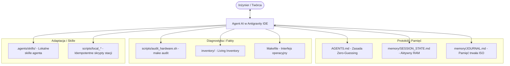

# `pl-agentic-sysadmin` — Autonomiczny Workstation Hub & Protokół AI SysAdmin (PL)

[](LICENSE)
[](https://youtube.com)

> *Autonomiczne centrum kontroli, audytu i odtwarzania stacji roboczej Linux, współpracujące w modelu ciągłej pamięci z agentami AI (Antigravity IDE, Claude Code) — edycja polskojęzyczna.*

Tradycyjne podejście do konfiguracji systemu (ręczne wklepywanie komend, niespójne dotfiles, amnezja chatbotów w przeglądarce) zawodzi w erze inżynierii agentowej. **`pl-agentic-sysadmin`** zamienia Twoje repozytorium w żyjący hub stacji roboczej, który daje agentowi AI oczy (audyt sprzętu), ręce (deterministyczne skrypty i Makefile) oraz trwałą pamięć.

---

## ⚡ Szybki Start

```bash
# 1. Klonowanie repozytorium
git clone https://github.com/mnemoshift/pl-agentic-sysadmin.git
cd pl-agentic-sysadmin

# 2. Wyświetlenie dostępnych poleceń interfejsu
make help

# 3. Przeprowadzenie błyskawicznego audytu sprzętu (CPU, RAM, GPU, Audio, Kamery)
make audit

# 4. Sprawdzenie zainstalowanego oprogramowania i usług
make inventory

# 5. Bezpieczna symulacja procedury Disaster Recovery (Dry-Run)
make restore-dry-run
```

---

## 🏛️ Architektura: 4 Filary Systemu



### 1. Zasada Zero-Guessing & Bezkolizyjne Aktualizacje (`AGENTS.md` + `AGENTS.local.md`)
Agent AI **nie ma prawa zgadywać** stanu Twojej maszyny. Każda zmiana jest poprzedzona audytem stanu faktycznego (*Pre-flight check*), wykonana atomowo z kopią zapasową i zweryfikowana po zakończeniu (*Post-flight verification*).

Co kluczowe dla użytkowników GitHuba: repozytorium rozdziela standard frameworka (`AGENTS.md`) od Twoich prywatnych reguł (`AGENTS.local.md` w `.gitignore`). Możesz w dowolnym momencie wykonać `git pull` po nowe funkcje od twórcy, a Twoje lokalne preferencje (KDE, inny dok, własne monitory) pozostaną w 100% nienaruszone (zero konfliktów Git).

### 2. Dwuwarstwowa Pamięć Międzysesyjna (Dual-Layer Memory)
- **`memory/SESSION_STATE.md` (Pamięć operacyjna / RAM):** Stan bieżący, aktywny cel sprintu, lista ukończonych zadań i parametry wykrytych monitorów.
- **`memory/JOURNAL.md` (Pamięć trwała / Dysk):** Niezmienny, chronologiczny rejestr zdarzeń pod datą `[YYYY-MM-DD]` zawierający twarde dowody z konsoli.

### 3. Samoadaptujące się Skille (Adaptive System Skills)
Kiedy zlecasz agentowi konfigurację pulpitu (np. instalację doku Plank, zmianę motywów, optymalizację pod wiele monitorów) lub procedurę resetu:
- Agent bada Twoją dystrybucję (Zorin, Ubuntu, Fedora, Arch) oraz środowisko graficzne (GNOME, KDE).
- Generuje lokalne skrypty wykonawcze (`scripts/local_*`).
- Rejestruje w projekcie lokalnego skilla `.agents/skills/desktop-manager/SKILL.md`.
- Wszystkie pliki specyficzne dla danej maszyny są w `.gitignore`, co pozwala zachować repozytorium w 100% czystym stanie.

### 4. Living Inventory & Disaster Recovery
Każda zainstalowana aplikacja, biblioteka czy usługa jest katalogowana w `inventory/`. W razie awarii dysku procedura `make restore-dry-run` oraz `scripts/restore_workstation.sh` przywracają całe środowisko programistyczne w 3 minuty.

---

## 📺 Materiał Wideo (YouTube)

Odcinek instruktażowy prezentujący działanie tego repozytorium krok po kroku oraz kontrast między pracą w terminalu a trybem Agentic:
- 🎬 **MnemoShift EP002:** *Pulpit Zorin OS: Terminal Oldschool vs Agentic SysAdmin (Od zera w Antigravity)* — [Obejrzyj na YouTube](https://youtube.com)

---

## 📄 Licencja

Projekt udostępniany na licencji MIT. Zobacz plik [LICENSE](LICENSE) po szczegóły.
