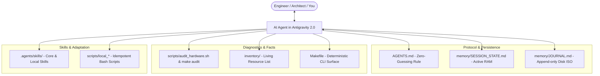

# `pl-agentic-sysadmin` — Autonomous Workstation Hub & Agentic SysAdmin Protocol

[](LICENSE)
[](https://www.youtube.com/@mnemoshift)

> 🇵🇱 **Polska Wersja:** Szukasz dokumentacji w języku polskim? [Przejdź do README.md](README.md).

> *Autonomous workstation control center, hardware audit, and disaster recovery protocol built for persistent Agentic AI workflows (Antigravity IDE, Claude Code) on Linux.*

The traditional approach to Linux desktop configuration (manual terminal tinkering, fragile dotfile symlinks, and browser chatbot amnesia) fails in the agentic era. **`pl-agentic-sysadmin`** transforms your Git repository into a living workstation hub that equips an AI agent with **eyes** (deterministic hardware audit), **hands** (declarative Makefile scripts), and **dual-layer persistence**.

---

## 📺 Video Screencast (YouTube)

Full walkthrough showing the contrast between 47 minutes of manual terminal configuration and a 60-second Agentic SysAdmin workflow:
* 🎬 **MnemoShift EP002:** *"Commands Are in the Man Pages." Why I Delegated Linux Config to an AI Agent* — **[Watch on YouTube](https://www.youtube.com/watch?v=wEVas1TWCns)**  
  *(Note: Audio is available in both Polish and English via YouTube's Multi-Language Audio feature).*

## 🖥️ Hardware & System Requirements

The workstation hub is engineered for maximum flexibility — spanning lightweight headless administration up to high-throughput on-prem generative AI pipelines:

| Component | Minimum | Recommended | Notes |
| :--- | :--- | :--- | :--- |
| **Operating System** | Zorin OS 17+ / Ubuntu 22.04+ | Zorin OS 17+ Pro / Ubuntu 24.04 LTS | GNOME Desktop (X11 & Wayland support) |
| **Processor (CPU)** | 4 cores / 8 threads | 8+ cores (x86_64) | Required for package builds and system automation |
| **System RAM** | 16 GB | 32 GB+ | Required for running local AI models and Kdenlive |
| **Storage** | 20 GB free space | NVMe SSD (PCIe 4.0) | High IOPS for neural model weights and media caching |
| **Graphics (GPU)** | *None (CPU fallback)* | NVIDIA RTX (8–12+ GB VRAM) | CUDA + official NVIDIA drivers (for Whisper/Breeze-TTS) |

> 💡 **Important Note:** All core SysAdmin workflows (desktop theming, CSD window control harmonization, hardware inventory, disaster recovery, Edge neural TTS) **run 100% on CPU** and do not require a dedicated GPU. NVIDIA GPU acceleration is solely utilized by optional local media pipelines (Whisper transcription, Breeze-TTS-2 speech synthesis, neural dubbing).

---

## ⚡ Quickstart (3 Minutes to Launch)

Bootstrap the environment and run a full hardware audit in four commands:

```bash
# 1. Clone the repository
git clone https://github.com/mnemoshift/pl-agentic-sysadmin.git ~/workspaces/pl-agentic-sysadmin
cd ~/workspaces/pl-agentic-sysadmin

# 2. Configure environment overrides (optional)
cp .env.example .env

# 3. Bootstrap Python environment and tools (uv workspace)
make setup

# 4. Generate the Living Inventory of your workstation (CPU, GPU, audio, displays)
make audit

# 5. Run test suite verification
make test
```

---

## 🚀 Running with Antigravity 2.0 / Claude Code

Once initialized, delegate workstation control to your AI agent:

### Step 1: Open and Configure in Antigravity 2.0
1. Launch **Antigravity 2.0** (from the application menu or via terminal: `antigravity`).
2. In the left sidebar, navigate to **Projects** $\rightarrow$ click **Add Project** (or **Open Folder**) and select:  
   `~/workspaces/pl-agentic-sysadmin`
3. **Security & Review Configuration:**
   * Open **Agent Settings $\rightarrow$ Security Preset** and set to `Default` (the agent will ask for confirmation before executing shell commands).
   * Set **Agent Behavior $\rightarrow$ Artifact Review Policy** to `Always Ask` (the agent will present an *Implementation Plan* before touching system configs).
   * *Tip: Once trust is established, you can relax these constraints for autonomous hands-free execution.*
4. **Ready!** The agent immediately bootstraps by reading `AGENTS.md` and loading the `desktop-manager` core skill.

---

## ⚡ Operational Interface (Makefile)

Prefer working directly from the command line? All agentic procedures are exposed via a deterministic Makefile:

```bash
# Display all available commands and descriptions
make help

# 🖥️ Desktop Profile Management (Dual-Engine: Wayland + X11)
make desktop-macos   # Deploy macOS broadcast profile (WhiteSur theme, left controls, auto-detect Wayland/X11, CSD fix)
make desktop-studio  # Deploy Cyber Studio profile (MnemoShift Cyber-Blueprint, Top Bar Emission HUD, Conky HUD)
make desktop-reset   # Instant vanilla reset back to factory Zorin OS desktop (1 second)
make desktop-status  # Audit display server (Wayland/X11), window decorations, panel position, and dock state

# 🔍 System Audit & Disaster Recovery
make audit           # Audit CPU, RAM, GPU, audio daemons, cameras, and display outputs
make inventory       # Living inventory of installed APT packages, Flatpaks, and repositories
make restore-dry-run # Safe dry-run simulation of workstation disaster recovery

# 🗣️ Neural TTS Reader (Select & Listen: Edge Neural TTS)
make tts-status      # Check TTS reader status, venv, and keyboard shortcuts
make tts-install     # Autonomous user-space installation, venv setup, and <Super>+R hotkey
make tts-config      # Graphical voice selector (Marek, Zofia, etc.) and speech rate adjustment
make tts-test        # Play a sample sentence to test voice quality

# 🎬 Media & Video Automation (New in EP003 - Kdenlive & Whisper)
make media-clean-audio INPUT=work/EP002_Short/input/raw_voiceover.mp4 OUTPUT=work/EP002_Short/assets/clean.wav EXCLUDE=28.9-32.6
make media-karaoke AUDIO=work/EP002_Short/assets/clean.wav OUTPUT=work/EP002_Short/assets/subtitles.ass FAST=1
make media-build-short WORKSPACE=work/EP002_Short
```

---

## 🏛️ Architecture: 4 Pillars of the System



### 1. The Zero-Guessing Rule & Conflict-Free Upstream Sync (`AGENTS.md` + `AGENTS.local.md`)
The AI agent **is never allowed to guess** your hardware state or user preferences. Every change begins with an automated pre-flight audit, executes atomically with backups, and concludes with post-flight verification.

To prevent merge hell, the framework strictly decouples upstream core logic (`AGENTS.md`) from your machine-specific overrides (`AGENTS.local.md`, git-ignored). You can run `git pull` anytime to receive framework updates without conflicting with your private multi-monitor setup or local sound routing.

### 2. Dual-Layer Cross-Session Memory
- **`memory/SESSION_STATE.md` (Working RAM):** Tracks the immediate objective, active session goals, and recently completed tasks.
- **`memory/JOURNAL.md` (Persistent Disk):** An append-only, ISO date-stamped (`[YYYY-MM-DD]`) record of architectural decisions, completed configurations, and operational milestones.

### 3. Core Skills vs. Local Skills
- **Core Skills (`.agents/skills/`):** Universal procedures versioned in Git (e.g., `desktop-manager`, addressing CSD quirks in Electron/Chromium apps).
- **Local Skills (`.agents/skills/local-*/`):** Machine-specific adaptations generated on-the-fly by the agent (e.g., custom 3-monitor geometry or RNNoise microphone filters), safely kept inside `.gitignore`.

### 4. Living Inventory & Disaster Recovery
Every installed tool, library, and system extension is continuously logged in `inventory/`. In the event of a disk failure or machine migration, `make restore-dry-run` and `scripts/restore_workstation.sh` recreate the entire developer environment in under 3 minutes.

---

## 📚 Interactive Walkthroughs & Playbooks

Explore practical end-to-end sessions in `docs/walkthroughs/` comparing legacy terminal toil against modern Agentic workflows:
- 🖥️ [**macOS-style Desktop on Zorin OS**](docs/walkthroughs/Desktop-a-la-MacOS.md) — GNOME desktop transformation, dual Plank docks, WhiteSur styling, and CSD headerbar fixes.
- 🧭 [**Dual-Engine Desktop Architecture (X11 vs Wayland)**](docs/desktop/DUAL_ENGINE_GUIDE.md) — TopChrome dock engineering, 2px edge trigger, and Zoom & Hop (1.2x) hover animation on laptops and workstations.
- ⚙️ [**Kdenlive and MCP Server Setup in User-Space**](docs/walkthroughs/Konfiguracja-Kdenlive-MCP.md) — rootless Flatpak installation, MLT melt CLI wrappers, XML generator fix, and Antigravity integration.
- 🎬 [**Autonomous YouTube Short Editing in Kdenlive with Agentic AI**](docs/walkthroughs/Montaz-Shorta-Kdenlive.md) — zero-subscription, local alternative to CapCut Pro: audio audit & normalization (-14 LUFS), 9:16 timeline composition, and dynamic karaoke subtitles (Whisper + ASS).
- 🎙️ [**Zero-Cloud AI Dubbing & Voiceover on GPU**](docs/walkthroughs/Lokalny-Dubbing-AI-Shorts.md) — sovereign voiceover pipeline on RTX 4060 Ti: voice sample extraction, Whisper transcription, engineering PL->EN translation, EBU R128 (-14 LUFS) mastering, and video muxing.
- 🗣️ [**'Select & Listen' Neural TTS Reader**](docs/walkthroughs/Czytnik-Glosowy-TTS.md) — rootless user-space Microsoft Edge Neural TTS, low-latency streaming pipeline to mpv (<250ms), Markdown sanitizer, and global `<Super>+R` shortcut.

---

## 📄 License

Distributed under the MIT License. See [LICENSE](LICENSE) for details.
