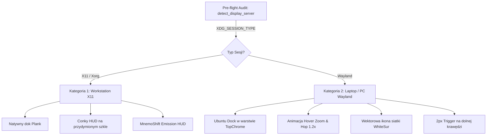

# Architektura Dwutorowa Pulpitu (Dual-Engine: X11 vs Wayland)
*Kompleksowy Przewodnik Inżynieryjny i Walkthrough dla Workstation Hub*

---

## 🎯 1. Wprowadzenie: Problem Doków w Erze Waylanda

Przygotowując stację roboczą Linux do profesjonalnej pracy lub nagrań wideo, jedną z najbardziej pożądanych ergonomii jest **układ w stylu macOS**:
- Smukły górny pasek systemowy (28px) z wyśrodkowaną datą i zegarem oraz zintegrowanym menu systemowym,
- Kolorowe kontrolki okien (traffic lights) po lewej stronie,
- **Przezroczysty, pływający dok aplikacji na dole ekranu**, który chowa się przy nachodzących oknach, ale natychmiast wysuwa się po zjechaniu kursorem myszy do dolnej krawędzi, a ikona pod kursorem powiększa się i lekko unosi (tzw. efekt *Zoom & Hop*).

Tradycyjne narzędzia Linuksa (np. dok **Plank**) zostały zaprojektowane ponad dekadę temu w oparciu o architekturę **X11 / Xorg**. W nowoczesnych dystrybucjach (takich jak Zorin OS 18 / Ubuntu 24.04 Noble), domyślnym serwerem wyświetlania na laptopach oraz komputerach z grafiką zintegrowaną (Intel/AMD) jest **Wayland**.

Pod Waylandem kompozytor GNOME Shell (Mutter) ze względów bezpieczeństwa i izolacji procesów nie pozwala zewnętrznym aplikacjom X11 na manipulowanie warstwami ekranu, pozycjonowanie doków czy tworzenie barier wskaźnika myszy. Efekt? Plank na Waylandzie nie działa lub zawiesza się w tle.

**Workstation Hub rozwiązuje ten problem architektonicznie poprzez dwutorowy silnik (Dual-Engine)** — system sam bada sprzęt i serwer wyświetlania, po czym autonomicznie wybiera optymalną ścieżkę.

---

## 🖥️ 2. Dwie Kategorie Środowiskowe



### Kategoria 1: Flagowa Stacja Robocza X11 (NVIDIA RTX / Multi-Monitor)
- **Charakterystyka sprzętu:** Dedykowane GPU NVIDIA (np. GeForce RTX 4060 Ti) ze sterownikami własnościowymi, konfiguracja wielu monitorów (np. 21:9 Ultrawide do montażu + 16:9 emisyjny do nagrywania screencastów).
- **Serwer wyświetlania:** `x11` (`XDG_SESSION_TYPE=x11`).
- **Rozwiązanie doku:** **Plank Dual-Dock** (`plank`):
  - Uruchamia się natywnie w sesji X11,
  - Obsługuje dwa niezależne doki (`dock1` dla monitora głównego z pełnym zestawem launcherów, `dock2` dla ekranu emisyjnego z minimalistyczną listą aktywnych okien),
  - Wspiera motywy `MnemoShift-HUD` oraz `Transparent` z natywnym powiększeniem ikon.
- **Telemetria:** Conky HUD na przydymionym szkle oraz rozszerzenie GNOME Shell MnemoShift Emission HUD.

### Kategoria 2: Stacja Robocza / Laptop Wayland (iGPU Intel/AMD / Hybryda)
- **Charakterystyka sprzętu:** Laptopy (np. Dell Vostro, ThinkPad) ze zintegrowaną grafiką Intel Haswell/Iris/Xe lub AMD Radeon, komputery z hybrydowym GPU pod sterownikiem open-source, domyślna instalacja Zorin OS 18.
- **Serwer wyświetlania:** `wayland` (`XDG_SESSION_TYPE=wayland`).
- **Rozwiązanie doku:** **Zoptymalizowany Ubuntu Dock (Dash-to-Dock)**:
  - Wbudowany w powłokę GNOME Shell, w 100% natywny dla Waylanda,
  - Wyeliminowano wszystkie ograniczenia fabrycznego rozszerzenia za pomocą 3 poprawek inżynieryjnych:
    1. **Warstwa `TopChrome` (Zawsze nad oknami):**  
       Domyślnie rozszerzenie dodawało dok przez `Main.layoutManager.addChrome(this)`, co w scenie Cluttera umieszczało go *poniżej* okien (`top_window_group`). Gdy okno (np. edytor Antigravity, przeglądarka) nachodziło na dolny obszar, dok był fizycznie zasłonięty i nie reagował na kursor. Poprawka rejestruje dok przez `Main.layoutManager.addTopChrome(this, { trackFullscreen: true })`, co gwarantuje, że dok jest na wierzchu ponad wszystkimi oknami.
    2. **Czuły Wyzwalacz Krawędziowy (2px Edge Trigger):**  
       Zarezerwowano 2-pikselowy niewidoczny pasek detekcji (`_slideoutSize = 2`) w warstwie TopChrome oraz usunięto relikt `user_time` z `_dockDwellTimeout` (który w Waylandzie anulował wysuwanie doku, jeśli okno było aktywne). Kursor dojeżdżający do dolnej krawędzi bezwzględnie aktywuje dok.
    3. **Animacja Zoom & Hop pod Kursorem (Styl Plank / macOS):**  
       Dla wszystkich ikon (aplikacje przypięte, otwarte okna, menu programów) dodano zdarzenie `notify::hover` w `appIcons.js`. Ikona pod kursorem powiększa się o 20% (`scale 1.2`) i unosi w górę o 6px (`translation_y: -6`) z płynnym wygładzaniem kwadratowym (`EASE_OUT_QUAD`, 120ms). Wskaźniki uruchomionych aplikacji (kropki DOTS) pozostają stabilne na dole paska.
    4. **Spójność Wektorowa WhiteSur:**  
       Zainstalowano brakującą ikonę `view-app-grid-zorin-symbolic.svg`, eliminując fabryczny błąd wyświetlania dużego symbolu `+` zamiast siatki aplikacji.

---

## ⚡ 3. Interfejs Operacyjny (Jak z tego korzystać)

Wszystkie operacje są w 100% zautomatyzowane w `Makefile` oraz `scripts/desktop_ctl.sh`:

### 1. Podgląd stanu i wykrytego serwera wyświetlania
```bash
make desktop-status
```
*Przykładowe wyjście:*
```text
==========================================================
  WORKSTATION HUB: STAN KONFIGURACJI PULPITU
==========================================================
Serwer wyświetlania:    Wayland (natywny dok: Ubuntu Dock / Dash to Dock)
Układ przycisków okien: 'close,minimize,maximize:'
Pozycja paska Zorina:   'TOP'
Wysokość paska Zorina:  28px
Aplikacje w pasku:      Ukryte (przeniesione do dolnego doku)
Układ zegara i daty:    Wyśrodkowany (macOS / Studio)
Motyw GTK:              'WhiteSur-Light'
Motyw ikon:             'WhiteSur-light'
Dok Wayland (Dash-to-Dock):AKTYWNY (animowany dok dolny)
Dok Plank aktywny:      NIE (nieaktywny)
==========================================================
```

### 2. Wdrożenie profilu macOS WhiteSur
```bash
make desktop-macos
```
Skrypt automatycznie:
- Bada typ sesji (`detect_display_server`),
- Jeśli **Wayland** $\rightarrow$ konfiguruje dok Wayland (`TopChrome`, zoom/hop, floating, ikony 48px, menu po lewej, ulubione),
- Jeśli **X11** $\rightarrow$ konfiguruje podwójny dok Plank (`dock1` + `dock2`),
- Konfiguruje górny pasek Zorina na 28px z wyśrodkowanym zegarem i ukrytymi aplikacjami,
- Wymusza kontrolki okien po lewej stronie (`close,minimize,maximize:`),
- Unifikuje belki CSD w aplikacjach VS Code i Google Chrome / Brave.

### 3. Błyskawiczny reset do stanu fabrycznego Zorin OS
```bash
make desktop-reset
```
W 1 sekundę przywraca stan domyślny dystrybucji (wyłącza doki, przywraca pasek Zorina na dół z wysokością 48px, cofa motywy i kontrolki okien).

---

## ⚠️ 4. Ważna Uwaga dla Użytkowników Waylanda: Przelogowanie Sesji

W powłoce **GNOME Shell 46** (architektura ES Modules / SpiderMonkey):
- Silnik GJS kompozytora keszuje załadowane moduły JavaScript (`.js`) w pamięci procesu `gnome-shell`.
- Po zaaplikowaniu modyfikacji doku (`docking.js` lub `appIcons.js`) pod Waylandem kompozytor nie przeładowuje modułów w locie (metoda DBus `ReloadExtension` jest wycofana).
- 👉 **Po pierwszym uruchomieniu `make desktop-macos` w sesji Wayland należy się jednorazowo wylogować i zalogować ponownie.**

Po zalogowaniu nowy kod ładuje się z pełnym wsparciem warstwy `TopChrome` oraz dynamiczną animacją unoszenia ikon!
